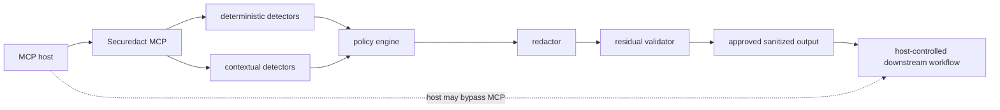

# SecuRedact MCP

<!-- mcp-name: io.github.GigantesHJI/securedact-mcp -->

[](https://pypi.org/project/securedact-mcp/)
[](https://pypi.org/project/securedact-mcp/)
[](LICENSE.md)

**SecuRedact** is a local-first privacy and security layer for AI agents and AI
workflows. It detects and protects sensitive data — personal data / PII,
GDPR-sensitive information, credentials, API keys, tokens, secrets, and
sensitive files — before that data reaches models, tools, files, or external
destinations.

SecuRedact MCP is the Apache-2.0 open-source MCP server and reusable Python
privacy engine. It detects sensitive text, applies versioned policies, redacts
locally, and validates residual output before marking sanitized content
approved.

> MCP mode does not automatically intercept every prompt. The host must invoke
> the tool and send only `sanitized_text` when `status == "ok"`; a misconfigured
> or malicious MCP host can bypass that ordinary MCP workflow. Provider-native
> enforced hooks are separate integration assets: when a supported provider
> invokes such a hook at its prompt lifecycle boundary, it can apply the same
> deterministic decision before normal model processing. See [SecuRedact
> Enforced](docs/enforced.md).

## Why SecuRedact

AI agents increasingly read files, call tools, and send prompts to external
models. That exposes PII, credentials, and sensitive documents unless something
checks the data first. SecuRedact is a privacy and security control for AI
workflows:

- **Local-first** — all detection, redaction, and policy evaluation run on your
  machine. No network listener by default, no telemetry, no provider calls.
- **PII / GDPR detection** — names, emails, IBANs, identifiers, and
  special-category data are detected and pseudonymized or redacted.
- **Secret & credential protection** — API keys, tokens, and passwords are
  detected and blocked from leaving your environment.
- **Filesystem protection** — reads are defended against traversal/symlink
  escapes and blocked from protected paths such as `.env`.
- **AI Agent Privacy Firewall** — enforced hooks for Claude Code and Gemini CLI
  run the same local decision before a prompt, model call, or tool action
  proceeds.
- **Network / egress awareness** — outbound tool calls are classified
  (internal/external/unknown) so policy can require approval or block egress.

SecuRedact helps reduce exposure of sensitive data; it is not a guarantee of
compliance or a claim that every leak is prevented. See
[Limitations](#security-and-limitations).

## Quick start

Install from PyPI and run the guided setup (Windows):

```powershell
py -3.12 -m pip install "securedact-mcp[ml]"
securedact-mcp setup
```

Linux / macOS:

```bash
python3.12 -m pip install "securedact-mcp[ml]"
securedact-mcp setup
```

Protect a piece of text in seconds (deterministic-only demo, no model needed):

```python
import os

os.environ["SECUREDACT_REQUIRE_FLAIR"] = "0"  # deterministic detectors only
from securedact_core import RedactionRequest, SecuredactEngine

engine = SecuredactEngine.from_environment()
result = engine.prepare(
    RedactionRequest(
        text="Contact alex@example.test, IBAN NL91ABNA0417164300",
        policy="strict_external_ai",
    )
)
print(result.status)  # "ok"
print(result.sanitized_text)  # "Contact [EMAIL_1], IBAN [IBAN_1]"
```

Reproducible synthetic security demos: [`docs/distribution/security-demo.md`](docs/distribution/security-demo.md).

## Safe default workflow

Use `prepare_for_external_ai` for normal external-AI preparation:

```json
{
  "text": "Contact alex@example.test",
  "policy": "strict_external_ai",
  "language": "auto",
  "response_mode": "minimal"
}
```

Approved response:

```json
{
  "schema_version": "1",
  "status": "ok",
  "sanitized_text": "Contact [EMAIL_1]",
  "counts": {"email": 1},
  "policy": "strict_external_ai",
  "policy_version": 1,
  "policy_digest": "...",
  "reason_codes": []
}
```

`review_required` and `blocked` responses never contain approved
`sanitized_text`. Minimal responses contain no original text, raw entity values,
mapping, exception body, stack trace, model path, or restoration handle unless
`restore_capable` was explicitly selected.

## Architecture and trust boundary



The server has no provider clients, OpenAI-compatible proxy, reverse proxy,
website, desktop chatbot, provider credentials, or provider-specific forwarding.
See [ADR 0001](docs/adr/0001-mcp-server-product-boundary.md) and the
[threat model](docs/threat-model.md).

## Tools

| Tool | Intended use | Sensitive-response behavior |
|---|---|---|
| `prepare_for_external_ai` | Recommended complete safe workflow | Minimal by default |
| `analyze_text` | Lower-level local analysis/review | Minimal; offsets in `review`; raw values only in enabled debug mode |
| `redact_text` | Lower-level compatibility operation | Minimal by default; explicit `legacy` mode is sensitive and deprecated |
| `restore_text` | Consume a local opaque session | Single-use by default; direct mappings require explicit trusted legacy mode |
| `create_safe_copy` | Write approved `.txt`/`.md` content under one configured root | Returns no mapping or absolute path |
| `securedact_read_file` | Safely read a local file and return only sanitized text | Blocks protected paths before reading; rejects traversal/symlink/binary; `minimal` by default |

Response modes are `minimal`, `review`, `debug`, and `restore_capable`. Debug is
disabled unless the process was started with
`SECUREDACT_ENABLE_DEBUG_RESPONSES=1`; an MCP request cannot enable it. In-memory
restoration sessions use cryptographic random handles, bounded capacity,
expiration, concurrency protection, and single-use consumption. Process exit
destroys all sessions.

See [MCP tools](docs/mcp-tools.md), [response privacy](docs/privacy-model.md), and
[restoration sessions](docs/restoration-sessions.md).

## Installation

Python `>=3.12,<3.13` is supported.

For a normal installation from PyPI:

```powershell
py -3.12 -m pip install "securedact-mcp[ml]"
securedact-mcp setup
```

On Linux or macOS, use `python3.12 -m pip install "securedact-mcp[ml]"`;
`python -m pip install "securedact-mcp[ml]"` is also appropriate when `python`
already selects a supported 3.12 environment.

`setup` checks the package, Python and ML dependencies, inspects local model
state, offers the existing consent-based model installer, runs the existing
offline verifier, and offers the packaged Claude Code and Gemini CLI
integrations when those hosts are detected. It uses the providers' official
plugin/extension commands and is safe to rerun. It does not call a provider
model API, accept provider trust automatically, or download a contextual model
unless the user explicitly selects model setup and accepts the existing
upstream prompt.

Manual model commands remain available for advanced or unattended operation:

```powershell
securedact-mcp install
securedact-mcp models verify
securedact-mcp
```

The last command starts a local `stdio` server. Standard output is reserved for
MCP protocol messages. `securedact-mcp setup --non-interactive` reports state
without implying upstream acceptance or configuring a new provider. Use
`--host claude`, `--host gemini`, or `--host all` for targeted interactive
provider setup.

### Developer/source installation

To work from a reviewed source checkout instead:

```powershell
git clone https://github.com/GigantesHJI/securedact-mcp.git
cd securedact-mcp
python -m pip install ".[ml]"
securedact-mcp setup
```

No model checkpoint is included in the repository or wheel, and startup never
downloads one. Securedact does not redistribute these model weights. Upstream
model weights retain their own licenses and are not relicensed by Apache-2.0.
See [model installation](docs/model-installation.md) and [third-party
licenses](docs/third-party-licenses.md).

Deterministic-only local development must be explicitly selected:

```powershell
$env:SECUREDACT_REQUIRE_FLAIR = "0"
securedact-mcp
```

Production defaults to requiring contextual capability and fails closed while a
configured model is missing, loading, corrupt, or unavailable.

## Host packages

Tested configuration assets and safe-workflow instructions are under
`integrations/` for Codex, Cursor, and Windsurf. The automated MCP client harness
validates server startup, tool listing, calls, minimal response shape, stdout
integrity, and shutdown. It does not prove that a real host invokes the tool for
every prompt. See the [compatibility evidence](docs/compatibility.md).

The repository is also a Gemini CLI extension root: `gemini extensions install
https://github.com/GigantesHJI/securedact-mcp` can install the hooks. The
`gemini-cli-extension` topic and a release whose tag tree contains the root
manifest are required for that path to resolve; without `pip install
"securedact-mcp[ml]"` and the local models the installed hooks do not enforce
anything. See [SecuRedact Enforced](docs/enforced.md).

## Policies and Python API

Built-ins include `default`, `strict_external_ai`, `gdpr`, `identifiers_only`,
and `review_all_contextual`; compatibility policies remain available. Local
organization policy files load only from the controlled policy directory, use a
strict declarative schema, and cannot disable fail-closed invariants. Unknown,
duplicate, oversized, malformed, or symlinked policies fail closed.

```python
from securedact_core import RedactionRequest, SecuredactEngine

engine = SecuredactEngine.from_environment()
result = engine.prepare(
    RedactionRequest(
        text="Contact alex@example.test",
        policy="strict_external_ai",
    )
)
```

`from_environment()` preserves the contextual-model requirement. Standalone
deterministic development requires `SECUREDACT_REQUIRE_FLAIR=0`; applications may
also inject tested detector implementations. See [public API](docs/public-api.md)
and [policies](docs/policies.md).

## Reproducible development

The committed `uv.lock` resolves runtime, ML, development, benchmark, and
security extras for Python 3.12.

```powershell
uv sync --frozen --extra dev --extra benchmark
uv run python scripts\verify.py
```

Never use real personal information, private documents, credentials, customer
logs, or model weights in tests, issues, screenshots, fixtures, or pull requests.
See [CONTRIBUTING.md](CONTRIBUTING.md).

## Evaluation and performance

```powershell
uv run python -m securedact_eval quality --mode deterministic --gate `
  --thresholds benchmarks\thresholds.json `
  --baseline benchmarks\baselines\quality-deterministic.json
uv run python -m securedact_eval performance --mode deterministic
```

The versioned synthetic corpus reports exact and relaxed span precision, recall,
F1, false-positive and false-negative rates, per-entity/language/domain/split
results, action/category accuracy, and bootstrap recall intervals. True negatives
are document-level negative examples, not token-level safety. The GDPR-related
suite is detection evaluation, not legal compliance certification. Real Flair
and GPU benchmarks require an explicitly configured local model and are not
ordinary CI. See [benchmarking](docs/benchmarking.md).
The [benchmark framework](benchmarks/README.md) documents local data tiers and large profiles;
the [migration plan](docs/benchmark-migration.md) defines its future extraction boundary. For a
failure before GitHub executes repository steps, use the
[CI troubleshooting decision tree](docs/ci-troubleshooting.md). Local success does not replace a
required GitHub check.

## Security and limitations

- No prompt, finding, mapping, restoration handle, secret, model input, or
  restored output is logged by application code.
- Deterministic and contextual detection can miss novel, ambiguous, or
  adversarial disclosure; coreference and universal obfuscation resistance are
  not claimed.
- Review offsets let a trusted local client with the original input reconstruct
  a value; keep review responses local.
- Host behavior and downstream provider behavior are outside the trust boundary.
- Repository security settings documented in files still require administrator
  verification.

Report vulnerabilities privately using [SECURITY.md](SECURITY.md). Do not put
vulnerability details or real data in a public issue.

## License

Original repository source and documentation are licensed under the
[Apache License 2.0](LICENSE.md). Copyright attribution is recorded in
[NOTICE](NOTICE). Third-party dependencies and model weights retain their own
licenses.
