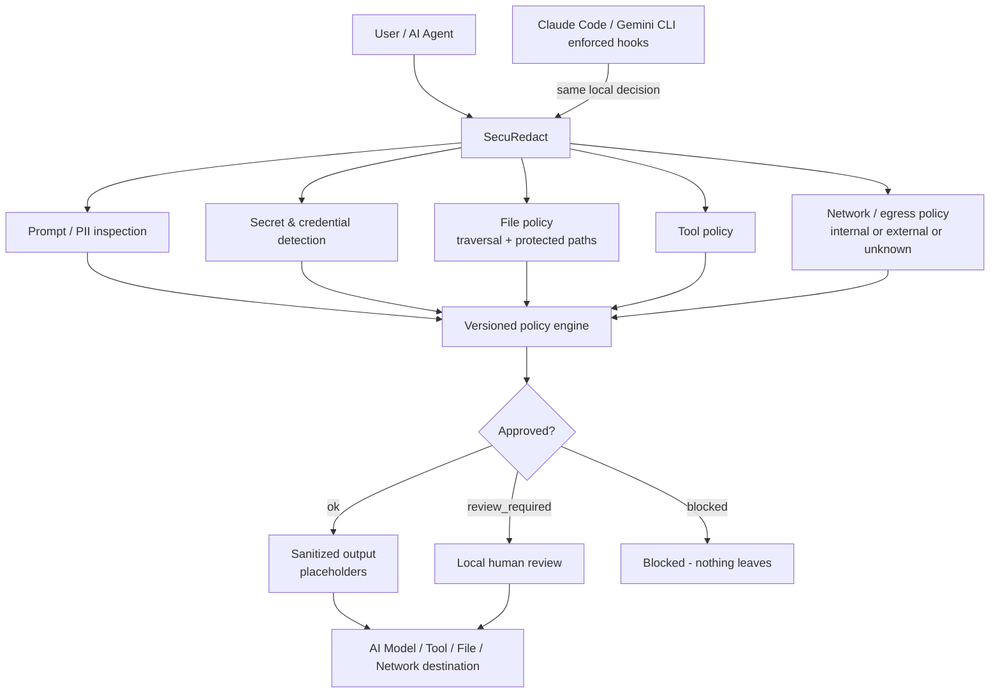

# Architecture

## Product boundary

Securedact is a local `stdio` MCP server plus a provider-neutral Python privacy
engine. It has no desktop shell, web UI, HTTP API, AI-provider adapter,
telemetry, unrestricted file reader, or model checkpoint in the package.

```text
MCP host
  -> Securedact stdio adapter
     -> request/schema and size validation
     -> local policy selection
     -> deterministic credentials + identifier detectors
     -> optional verified local Flair detector
     -> deterministic merge and policy action
     -> redaction and residual validation
     -> minimal structured result
  -> host checks status == "ok"
  -> host sends sanitized_text only
```

The recommended operation is the single high-level
`prepare_for_external_ai` tool. Lower-level analysis and redaction operations
exist for trusted local review and compatibility. MCP registration cannot force
a host to invoke Securedact or prevent the host from separately forwarding the
original input.

## Architecture diagram



## Code ownership

- `securedact_core` owns typed schemas, detection, deterministic merge, policy
  decisions, redaction, residual validation, and bounded restoration sessions.
- `securedact_mcp` owns MCP schemas, runtime readiness, managed local-model
  lifecycle, safe-copy restrictions, and `stdio` protocol integrity.
- `securedact_eval` owns versioned corpus validation, quality metrics,
  confidence intervals, performance measurement, reports, and release gates.
- `integrations` contains examples only; hosts remain responsible for routing
  and approved-field selection.

All production detector stacks require the regex, credentials, and curated
contextual-rule layers. Contextual Flair coverage is required by default and
must come from the verified managed model store. Initialization remains fast;
model validation/loading starts after the MCP initialized notification, and
calls made while loading fail closed without queuing their input.

## Decisions and data flow

`minimal` responses contain status, policy metadata, aggregate counts, reason
codes, and—only for an approved result—`sanitized_text`. `review` adds offsets
and classifications without raw substrings. `debug` may include raw values, but
is disabled unless the process started with
`SECUREDACT_ENABLE_DEBUG_RESPONSES=1`. `restore_capable` returns an opaque local
session handle instead of a mapping.

Blocked and review-required responses never contain `sanitized_text`.
Credentials and special-category data block under `strict_external_ai`.
Residual validation is mandatory for approved high-level output.

## Restoration and safe copies

Restoration mappings live only in a bounded, synchronized in-memory vault.
Handles are random, expire after 15 minutes by default, and can be consumed
once. Mappings are erased on consumption, expiry, cleanup, engine close, or
process exit. The MCP compatibility route accepting a direct mapping requires
`trusted_local_review: true` and is deprecated.

`create_safe_copy` accepts content, not a source path. It sanitizes through the
same high-level operation, creates only a `.txt` or `.md` basename under a
configured root, refuses overwrite, and returns a filename rather than an
absolute path.

## Setup/runtime separation

Package installation and normal MCP startup perform no model download. The
separate consent-gated installer fetches only allowlisted immutable official
Hugging Face snapshots into staging, verifies exact manifests and hashes, runs
an offline fresh-process Flair load, then activates atomically. Runtime is
offline and re-verifies managed state.

See the product-boundary decision in
[ADR 0001](adr/0001-mcp-server-product-boundary.md) and the bypass warning in
[Privacy model](privacy-model.md).
